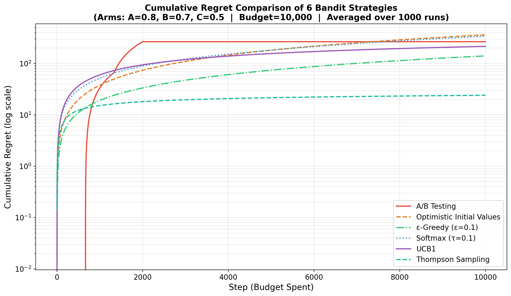

# 🎰 Multi-Armed Bandit 策略比較：Cumulative Regret 分析

## 📌 專案簡介

本專案為**深度強化學習**課堂活動作業，目標是比較 6 種經典的 Multi-Armed Bandit（多臂老虎機）探索–利用策略，並透過 **Cumulative Regret**（累積遺憾值）來衡量各策略的表現。

所有策略在相同的問題設定下進行模擬，結果取 1,000 次 Monte-Carlo 模擬的平均值，以確保統計穩定性。

## 🧩 問題設定

| 參數 | 數值 |
|------|------|
| 總預算 | $10,000（10,000 步） |
| Bandit 數量 | 3（A、B、C） |
| 獎勵分佈 | Bernoulli（回報為 0 或 1） |
| Monte-Carlo 模擬次數 | 1,000 |

### Arm 的真實期望值

| Arm | True Mean |
|-----|-----------|
| A | 0.8 |
| B | 0.7 |
| C | 0.5 |

最佳策略為**始終選擇 Arm A**（μ* = 0.8），其總期望獎勵為 8,000。

## 🧠 六種策略說明

| # | 策略 | 探索方式 | 說明 |
|---|------|----------|------|
| 1 | **A/B Testing** | 靜態分配 | 前 2,000 步平均分配給三個 Arm，之後完全利用觀測到的最佳 Arm |
| 2 | **Optimistic Initial Values** | 隱式探索 | 初始 Q 值設為 1.0（樂觀），透過自然衰減促使探索 |
| 3 | **ε-Greedy**（ε=0.1） | 隨機探索 | 每步有 10% 機率隨機選擇 Arm，否則選擇當前最佳 |
| 4 | **Softmax / Boltzmann**（τ=0.1） | 機率性探索 | 依 exp(Q/τ) 的機率分佈選擇 Arm |
| 5 | **UCB1**（c=2.0） | 信心區間 | 選擇 Q + c·√(ln t / N) 最大的 Arm |
| 6 | **Thompson Sampling** | Bayesian 探索 | 從每個 Arm 的 Beta 後驗分佈中抽樣，選最大者 |

## 📊 運算結果

### Cumulative Regret 比較圖



> 縱軸為 log scale，可清楚看出各策略之間的數量級差異。

### 數值摘要（平均 1,000 次模擬）

| 策略 | Total Reward | Total Regret |
|------|-------------|-------------|
| Thompson Sampling | 7,975.9 | **24.1** |
| ε-Greedy (ε=0.1) | 7,859.0 | 141.0 |
| UCB1 | 7,783.9 | 216.1 |
| A/B Testing | 7,733.5 | 266.5 |
| Softmax (τ=0.1) | 7,658.5 | 341.5 |
| Optimistic Initial Values | 7,638.8 | 361.2 |
| **Optimal（始終選 A）** | **8,000.0** | **0.0** |

### 關鍵觀察

- **Thompson Sampling** 表現最佳，Regret 僅 24.1，因為 Bayesian 更新能快速鎖定最佳 Arm
- **A/B Testing** 簡單但浪費——前 2,000 步的靜態探索期間累積了大量 Regret
- **ε-Greedy** 是穩定的 baseline，但即使在 exploitation 階段仍持續隨機探索
- **UCB1** 和 **Softmax** 的 Regret 穩定增長，因為它們持續進行不同程度的探索
- **Optimistic Initial Values** 的 Regret 較高，因為初始樂觀值的影響需要多次拉動才能消退

## 🛠️ 使用方式

### 環境需求

- Python 3.10+
- 依賴套件見 `requirements.txt`

### 安裝與執行

```bash
# 建立並啟用虛擬環境
python -m venv .venv
source .venv/bin/activate

# 安裝依賴
pip install -r requirements.txt

# 執行模擬並生成圖表
python bandit_comparison.py
```

執行完成後會自動輸出數據摘要並儲存圖表為 `regret_comparison.png`。

## 📁 專案結構

```
DIC3/
├── bandit_comparison.py    # 主程式：6 種策略模擬與繪圖
├── requirements.txt        # Python 依賴套件
├── regret_comparison.png   # 運算結果圖表
├── chat_conversation.md    # 與 LLM 的對話紀錄
├── .gitignore
└── README.md               # 本文件
```

## 💬 LLM 對話紀錄

本專案的開發過程中使用了 LLM 輔助，完整的對話紀錄請參閱 [chat_conversation.md](chat_conversation.md)。
